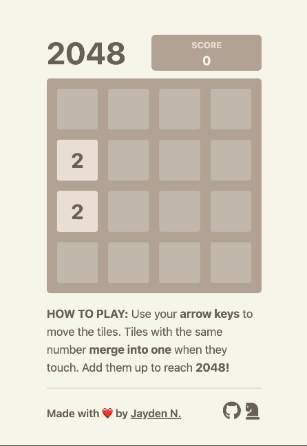

# Twenty48

[![Open issues][issues-badge]][issues-url]
[![TypeScript][typescript-badge]][typescript-url]

[issues-badge]: https://img.shields.io/github/issues/jayden-n/twenty48
[issues-url]: https://github.com/jayden-n/twenty48/issues
[typescript-badge]: https://badges.frapsoft.com/typescript/code/typescript.svg?v=101
[typescript-url]: https://github.com/microsoft/TypeScript

## Installation

Start dev server on [localhost](http://localhost:3000):

-   clone
-   `npm install`
-   `npm run dev`

## Features

-   Fully-functional 2048 game clone
-   Animations

## Technologies

-   [Next.js](https://nextjs.org/) + [React](https://react.dev) for building UI out of components
-   [TypeScript](https://www.typescriptlang.org) for ensuring a self-documenting & type-safe codebase
-   [Module CSS](https://nextjs.org/docs/app/building-your-application/styling/css-modules#css-modules) for responsive design with animations
-   [Jest](https://jestjs.io/) for implementing unit testing
-   [lodash](https://jestjs.io/) for tiles movements helper functions

## Running Unit Testing suite

-   `npm run test`

## Running Test Coverage

-   `npm run test-coverage`

## Acknowledgement

Created by [Jayden Nguyen](https://jaydennguyen.dev/). Based on the original Gameplay [2048!](https://play2048.co/)
